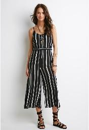
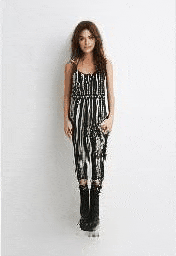
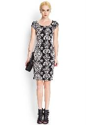
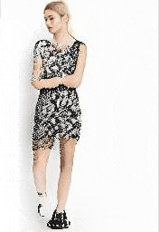
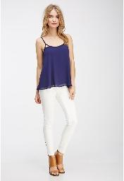
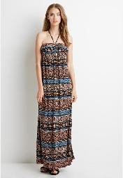
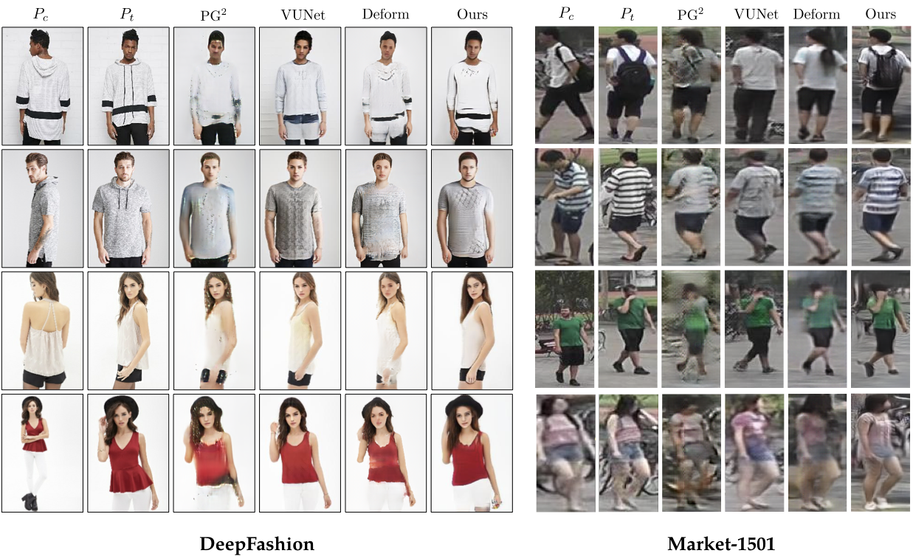

# Pose-Transfer
Code for the paper **Progressive Pose Attention for Person Image Generation** in **CVPR19(Oral)**. The paper is available [here](http://arxiv.org/abs/1904.03349). 

<p float="center">
	
  	
  	
	
	
    
    
    
</p>

Video generation with a single image as input. More details can be found in the supplementary materials in our [paper](http://arxiv.org/abs/1904.03349).


<!-- <figure class="fourth">
	
	
    
    
</figure> -->

<!-- 
 -->

## News 
- We have released a new branch **PATN_Fine**. We introduce a segment-based skip-connection and a novel segment-based style loss, achieving even better results on DeepFashion.
- [Video demo](https://youtu.be/bNHFPMX9BVk) is available now. We further improve the performance of our model by introducing a segment-based skip-connection. We will release the code soon. Refer to our [supplementary materials](http://arxiv.org/abs/1904.03349) for more details. 
- Codes for pytorch 1.0 is available now under the branch **pytorch_v1.0**. The same results on both datasets can be reproduced with the pretrained model. 

### Notes:
In pytorch 1.0, **running_mean** and **running_var** are not saved for the **Instance Normalization layer** by default. To reproduce our result in the paper, launch ``python tool/rm_insnorm_running_vars.py`` to remove corresponding keys in the pretrained model. (Only for the DeepFashion dataset.)




This is Pytorch implementation for pose transfer on both Market1501 and DeepFashion dataset. The code is written by [Tengteng Huang](https://github.com/tengteng95) and [Zhen Zhu](https://github.com/jessemelpolio).

## Requirement
* pytorch 1.0.1
* torchvision
* numpy
* scipy
* scikit-image
* pillow
* pandas
* tqdm
* dominate


## Getting Started
### Installation

- Clone this repo:
```bash
git clone https://github.com/tengteng95/Pose-Transfer.git
cd Pose-Transfer
```

### Data Preperation
We provide our **dataset split files** and **extracted keypoints files** for convience.

#### Market1501
- Download the Market-1501 dataset from [here](http://www.liangzheng.com.cn/Project/project_reid.html). Rename **bounding_box_train** and **bounding_box_test** to **train** and **test**, and put them under the ```market_data``` directory.
- Download train/test splits and train/test key points annotations from [Google Drive](https://drive.google.com/open?id=1YMsYXc41dR3k8YroXeWGh9zweNUQmZBw) or [Baidu Disk](https://pan.baidu.com/s/1fcMwXTUk9XKPLpaJSodTrg), including **market-pairs-train.csv**, **market-pairs-test.csv**, **market-annotation-train.csv**, **market-annotation-train.csv**. Put these four files under the ```market_data``` directory.
- Generate the pose heatmaps. Launch
```bash
python tool/generate_pose_map_market.py
```


#### DeepFashion

**Note: In our settings, we crop the images of DeepFashion into the resolution of 176x256 in a center-crop manner.**
<!-- - Download the DeepFashion dataset from [here](http://mmlab.ie.cuhk.edu.hk/projects/DeepFashion/InShopRetrieval.html) -->
- Download [deep fasion dataset in-shop clothes retrival benchmark](http://mmlab.ie.cuhk.edu.hk/projects/DeepFashion/InShopRetrieval.html). You will need to ask a pasword from dataset maintainers. 
- Split the raw images into the train split (```fashion_data/train```) and the test split (```fashion_data/test```). Crop the images. Launch
```bash
python tool/generate_fashion_datasets.py
``` 
- Download train/test pairs and train/test key points annotations from [Google Drive](https://drive.google.com/open?id=1YMsYXc41dR3k8YroXeWGh9zweNUQmZBw) or [Baidu Disk](https://pan.baidu.com/s/1fcMwXTUk9XKPLpaJSodTrg), including **fasion-resize-pairs-train.csv**, **fasion-resize-pairs-test.csv**, **fasion-resize-annotation-train.csv**, **fasion-resize-annotation-train.csv**. Put these four files under the ```fashion_data``` directory.
- Generate the pose heatmaps. Launch
```bash
python tool/generate_pose_map_fashion.py
```

#### Notes:
**Optionally, you can also generate these files by yourself.**

1. Keypoints files

We use [OpenPose](https://github.com/ZheC/Realtime_Multi-Person_Pose_Estimation) to generate keypoints. 

- Download pose estimator from [Google Drive](https://drive.google.com/open?id=1YMsYXc41dR3k8YroXeWGh9zweNUQmZBw) or [Baidu Disk](https://pan.baidu.com/s/1fcMwXTUk9XKPLpaJSodTrg). Put it under the root folder ``Pose-Transfer``.
- Change the paths **input_folder**  and **output_path** in ``tool/compute_coordinates.py``. And then launch
```bash
python2 compute_coordinates.py
```

2. Dataset split files

```bash
python2 tool/create_pairs_dataset.py
```

<!-- #### Pose Estimation
- Download the pose estimator from [here](https://github.com/ZheC/Realtime_Multi-Person_Pose_Estimation).
- Launch ```python compute_cordinates.py``` to get the pose estimation for both datasets.

OR you can download our generated pose estimations from here. (Coming soon.) --> 

### Train a model
Market-1501
```bash
python train.py --dataroot ./market_data/ --name market_PATN --model PATN --lambda_GAN 5 --lambda_A 10  --lambda_B 10 --dataset_mode keypoint --no_lsgan --n_layers 3 --norm batch --batchSize 32 --resize_or_crop no --gpu_ids 0 --BP_input_nc 18 --no_flip --which_model_netG PATN --niter 500 --niter_decay 200 --checkpoints_dir ./checkpoints --pairLst ./market_data/market-pairs-train.csv --L1_type l1_plus_perL1 --n_layers_D 3 --with_D_PP 1 --with_D_PB 1  --display_id 0
```

DeepFashion
```bash
python train.py --dataroot ./fashion_data/ --name fashion_PATN --model PATN --lambda_GAN 5 --lambda_A 1 --lambda_B 1 --dataset_mode keypoint --n_layers 3 --norm instance --batchSize 7 --pool_size 0 --resize_or_crop no --gpu_ids 0 --BP_input_nc 18 --no_flip --which_model_netG PATN --niter 500 --niter_decay 200 --checkpoints_dir ./checkpoints --pairLst ./fashion_data/fasion-resize-pairs-train.csv --L1_type l1_plus_perL1 --n_layers_D 3 --with_D_PP 1 --with_D_PB 1  --display_id 0
```


### Test the model
Market1501
```bash
python test.py --dataroot ./market_data/ --name market_PATN --model PATN --phase test --dataset_mode keypoint --norm batch --batchSize 1 --resize_or_crop no --gpu_ids 2 --BP_input_nc 18 --no_flip --which_model_netG PATN --checkpoints_dir ./checkpoints --pairLst ./market_data/market-pairs-test.csv --which_epoch latest --results_dir ./results --display_id 0
```


DeepFashion
```bash
python test.py --dataroot ./fashion_data/ --name fashion_PATN --model PATN --phase test --dataset_mode keypoint --norm instance --batchSize 1 --resize_or_crop no --gpu_ids 0 --BP_input_nc 18 --no_flip --which_model_netG PATN --checkpoints_dir ./checkpoints --pairLst ./fashion_data/fasion-resize-pairs-test.csv --which_epoch latest --results_dir ./results --display_id 0
```

### Evaluation
We adopt SSIM, mask-SSIM, IS, mask-IS, DS, and PCKh for evaluation of Market-1501. SSIM, IS, DS, PCKh for DeepFashion.

#### 1) SSIM and mask-SSIM, IS and mask-IS, mask-SSIM

For evaluation, **Tensorflow 1.4.1(python3)** is required. Please see ``requirements_tf.txt`` for details.

For Market-1501:
```bash
python tool/getMetrics_market.py
```

For DeepFashion:
```bash
python tool/getMetrics_market.py
```

If you still have problems for evaluation, please consider using **docker**. 

```bash
docker run -v <Pose-Transfer path>:/tmp -w /tmp --runtime=nvidia -it --rm tensorflow/tensorflow:1.4.1-gpu-py3 bash
# now in docker:
$ pip install scikit-image tqdm 
$ python tool/getMetrics_market.py
```

Refer to [this Issue](https://github.com/tengteng95/Pose-Transfer/issues/4).

#### 2) DS Score
Download pretrained on VOC 300x300 model and install propper caffe version [SSD](https://github.com/weiliu89/caffe/tree/ssd). Put it in the ssd_score forlder. 

For Market-1501:
```bash
python compute_ssd_score_market.py --input_dir path/to/generated/images
```

For DeepFashion:
```bash
python compute_ssd_score_fashion.py --input_dir path/to/generated/images
```

#### 3) PCKh

- First, run ``tool/crop_market.py`` or ``tool/crop_fashion.py``.
- Download pose estimator from [Google Drive](https://drive.google.com/open?id=1YMsYXc41dR3k8YroXeWGh9zweNUQmZBw) or [Baidu Disk](https://pan.baidu.com/s/1fcMwXTUk9XKPLpaJSodTrg). Put it under the root folder ``Pose-Transfer``.
- Change the paths **input_folder**  and **output_path** in ``tool/compute_coordinates.py``. And then launch
```bash
python2 compute_coordinates.py
```
- run ``tool/calPCKH_fashion.py`` or ``tool/calPCKH_market.py``


### Pre-trained model 
Our pre-trained model can be downloaded [Google Drive](https://drive.google.com/open?id=1YMsYXc41dR3k8YroXeWGh9zweNUQmZBw) or [Baidu Disk](https://pan.baidu.com/s/1fcMwXTUk9XKPLpaJSodTrg).

##### Notes:
In pytorch 1.0, **running_mean** and **running_var** are not saved for the **Instance Normalization layer** by default. To reproduce our result in the paper, launch ``python tool/rm_insnorm_running_vars.py`` to remove corresponding keys in the pretrained model. (Only for the DeepFashion dataset.)


## Citation
If you use this code for your research, please cite our paper.
```
@inproceedings{zhu2019progressive,
  title={Progressive Pose Attention Transfer for Person Image Generation},
  author={Zhu, Zhen and Huang, Tengteng and Shi, Baoguang and Yu, Miao and Wang, Bofei and Bai, Xiang},
  booktitle={Proceedings of the IEEE Conference on Computer Vision and Pattern Recognition},
  pages={2347--2356},
  year={2019}
}
```

### Acknowledgments
Our code is based on the popular [pytorch-CycleGAN-and-pix2pix](https://github.com/junyanz/pytorch-CycleGAN-and-pix2pix).
